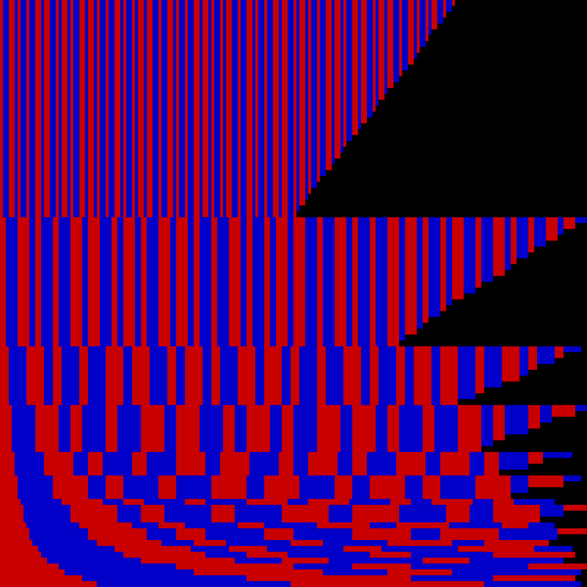

# Kolakoski Sequence Generator and Viewer

## Introduction

The [Kolakoski sequence](https://en.wikipedia.org/wiki/Kolakoski_sequence) is an integer sequence that is its own run length encoding.
The aim of this program is to generate and display the Kolakoski sequence in an image file format in a manner which highlights its recursive nature.

## What it does so far

The program can render a not paritcularly enlightening image of the Kolakoski sequence (shown below), which demonstrates a few of its interesting features.
The current aim is to amend the generation and display process so that a clearer image is produced.

