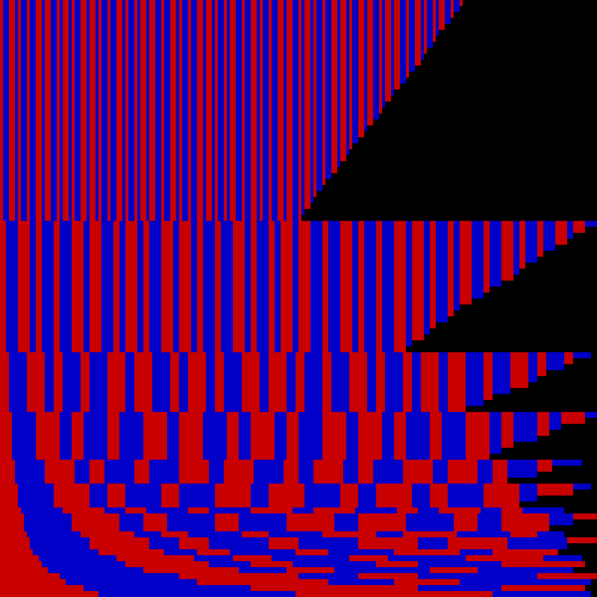
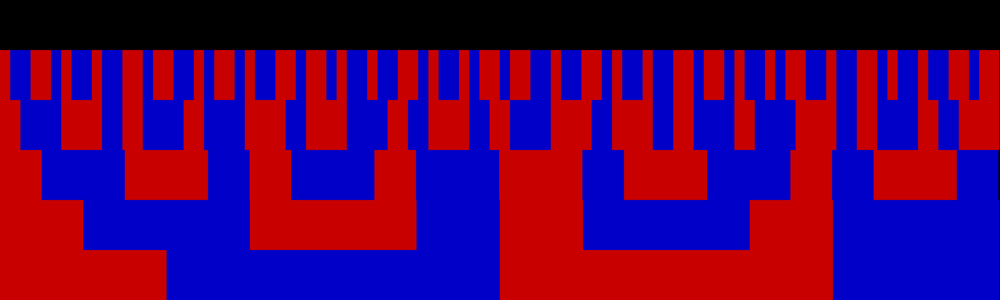

# Kolakoski Sequence Generator and Viewer

## Introduction

The [Kolakoski sequence](https://en.wikipedia.org/wiki/Kolakoski_sequence) is an integer sequence that is its own run length encoding.
The aim of this program is to generate and display the Kolakoski sequence in an image file format in a manner which highlights its recursive nature.

## What it does so far

The program has moved beyond displaying the image shown below and now generates a much clearer image of the sequence.

The new image shows a little of the recursive nature of the sequence but it still is a bit rough around the edges. Fixing these is the next step.
